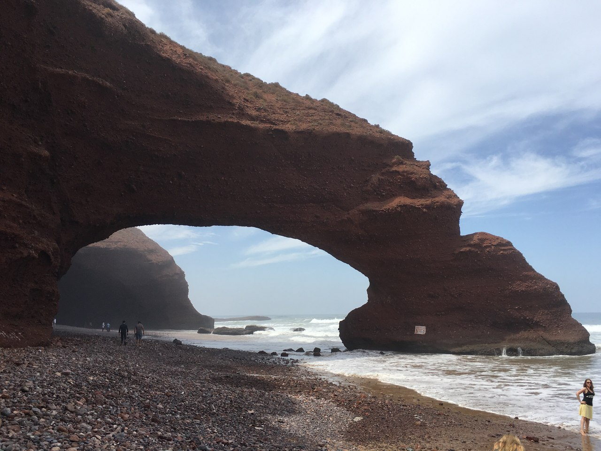
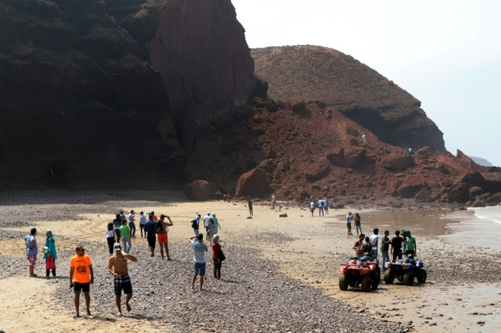
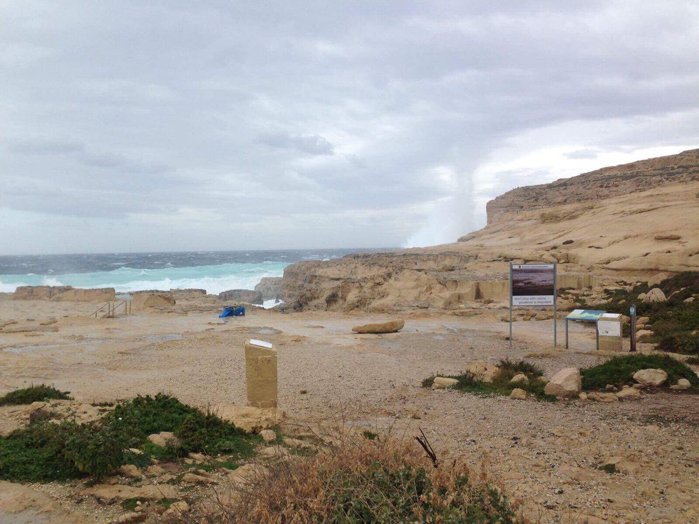

Three days ago a natural arch called Azure Window collapsed in Gozo, Malta. This arch was included on Malta's tentative list of UNESCO World Heritage Sites. It was used as background in some well-known movies such as the Game of Thrones and the Count of Monte-Cristo. It was also a famous place for tourists, so thousands of photos were taken there.

I also have a pic standing in front of it ☺️

Actually, I look a bit tired here. That's because of Guinness that we had drunk the night before with a Polish man, Derek. 🍻 It was quite funny, we were discussing Russian classical literature that night. But the morning powerboat trip made me feel sick 😓

Another interesting fact is that my cousin Anastasia told me that she had been to Maroc and had taken a photo of an arch on the Legzira beach. It also collapsed on September 2016. So, for now, our score in counting collapsed arches is 1-1.

Here are some photos of Legzira arch:

And this photo shows how the Azure Window looks like now:

Well, sad, but true. 😳 Nature creates such beautiful places in many years and collapses in just one day. Don't sit at home, go and take a photo of other arches before they collapsed 😀
