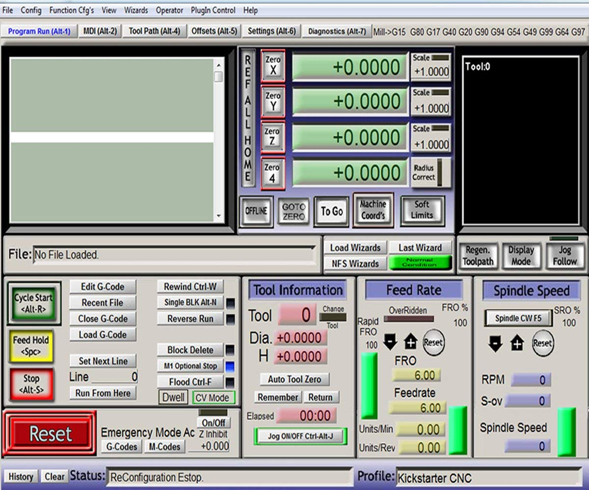

Long time no posts, huh? I have a lot of interesting news and I hope to have some time to write it here. However, this post was inspired by my yesterday's experience.

Working with old desktop software makes me nostalgic. Look at this rich and a bit messy interface.

My dad bought a CNC milling machine and the responsibility of connecting and configuring it became mine. So we have an old PC with an LPT port, Windows 7 on it, Mach3 software and a CNC milling machine. Let's connect it together and run, seems easy.

After connecting the machine via LPT and running Mach3 nothing happened. The program couldn't see the hardware. This was the beginning of several hours of googling and trying to figure out how to make it work.

Long story short, these are steps that made Mach3 see the CNC device:

1. You need to have a 32 bit system. I installed **Windows 7 32 bit** and Mach3. You can also use Windows XP. On this step the software cannot see the milling machine.
2. I checked the LPT port settings in BIOS. Some people say it should run in **ECP mode**. The software still cannot see the milling machine.
3. On some forum I've read that the Mach3 and DriverTest **software must be run in Windows XP compatibility mode.** To do this, right click on the program (e.g. c:/mach3/mach3.exe), choose properties, go to compatibility tab and choose the corresponding operating system. After doing this the behavior changed. Running Mach3 and DriverTest would reboot my PC every time I try it. At least something changed!
4. Trying to figure out what was happening, I found out that **some Windows 7 security updates break Mach3.** At least updates with numbers KB4088875 and KB4103718. However, I didn't have such updates. I tried to delete all security updates ([this article explains how to do that](https://itstillworks.com/remove-windows-7-updates-8169897.html)). **Warning:** removing security updates might cause risks especially when your machine is connected to the Internet.
5. After removing security updates Mach3 started correctly and it was able to see the milling machine.

I hope this information was helpful to somebody. 🙂
