As a Futurama fan, I couldn't miss the news about the [Futurama: Worlds of Tomorrow](https://futuramaworldsoftomorrow.gamepedia.com) game and downloaded it.

The last thing I heard about this franchise is that we'll probably never see new series. But that didn't mean that we won't see games.

In this short note, I've attached an introduction trailer as well as some basic gameplay.

<iframe src="https://www.youtube.com/embed/BKRrpnxupfI" width="100%" frameborder="0" allowfullscreen="allowfullscreen"></iframe>

The story of the game starts when Professor Farnsworth brings good news to everyone, the team has a new delivery task to Amphibious 9. Nobody knows (cares?) that Professor is under Hypnotoad's control. When they arrive at the planet, Hypnotoad meets its love from a perpendicular universe and this meeting brakes the prophylactic membrane between universes. Fry holds Leela but the gravity is stronger, so Leela flies away to a perpendicular universe.

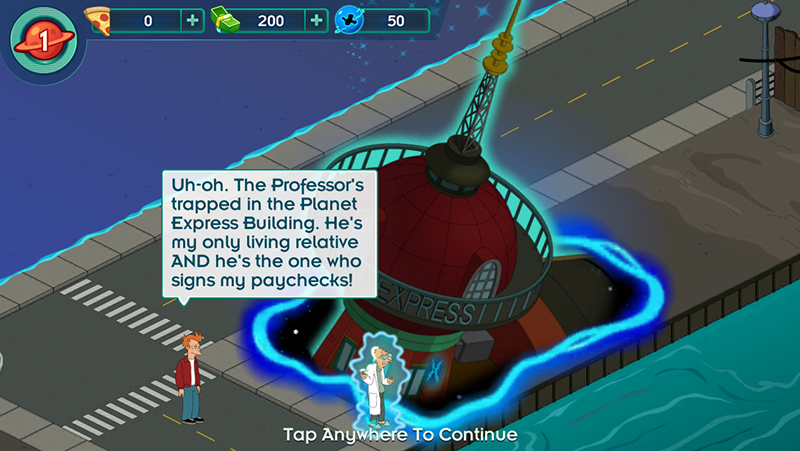

Now Fry has to rescue Leela and others. To do that, he has to collect seven artifacts from the universe.

Below I show some screenshots from the game. I hope it won't spoil anything. I didn't get far from the start.

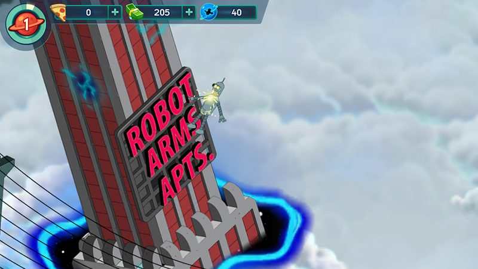

Bender is in trouble!

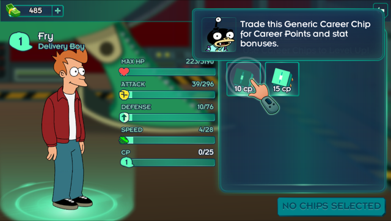

Characters have some specs and level.

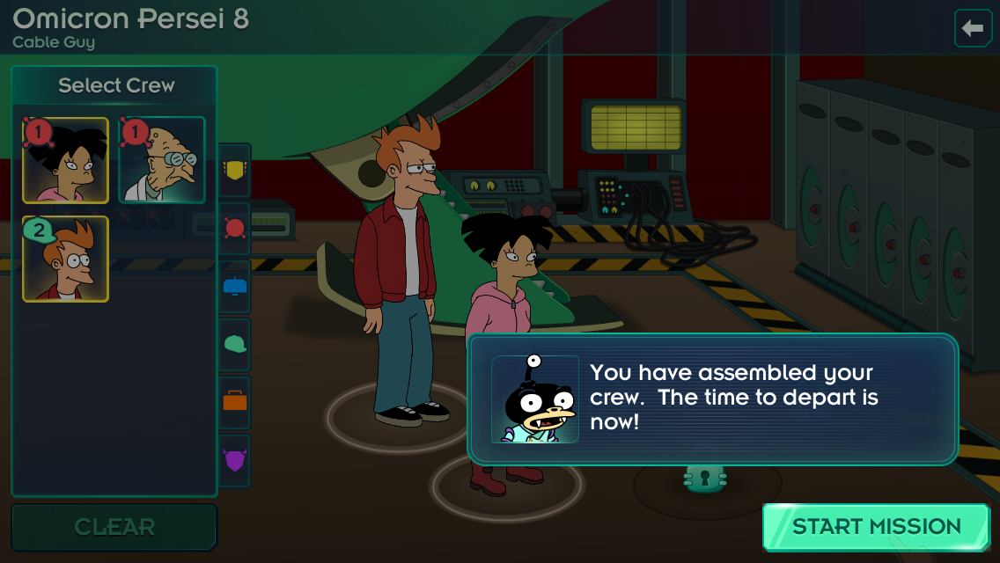

To perform a task you should assemble a crew.

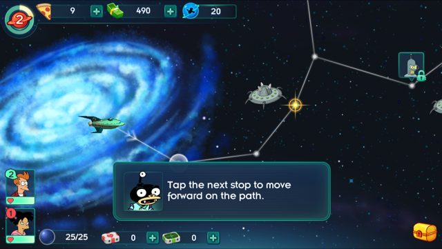

Traveling through the universe.

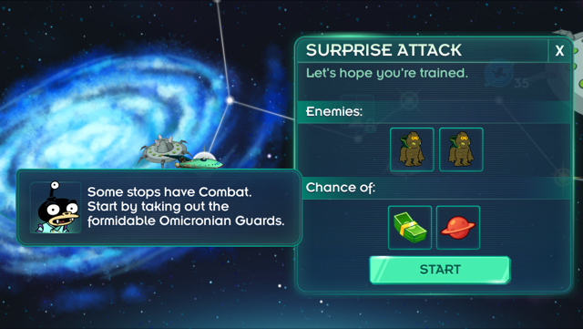

We're going to fight some Omicronians!

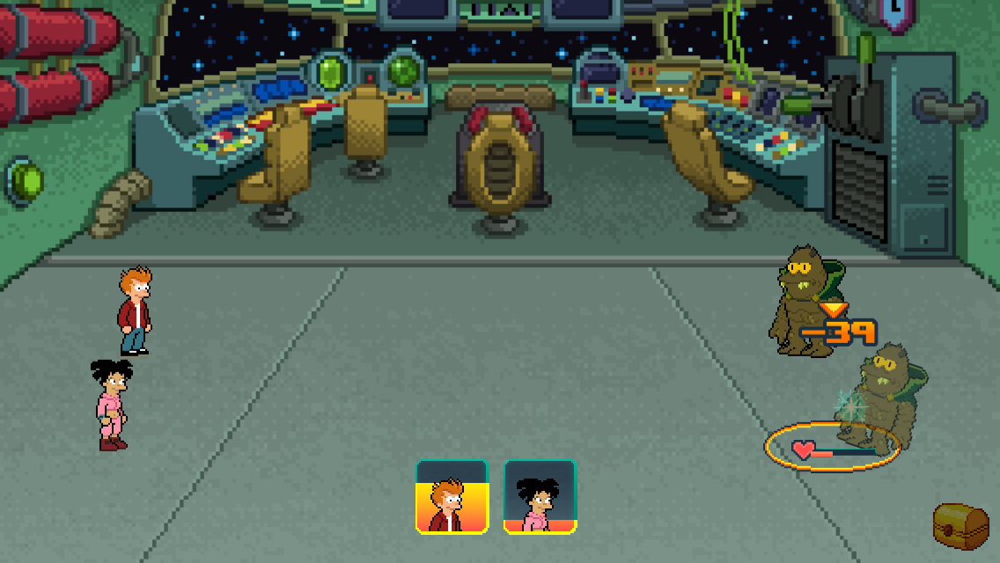

8-bit fighting mode! You can give a critical hit, block an attacker and use super-weapon.

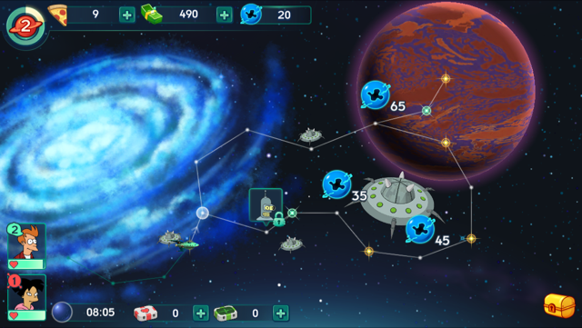

Continue our journey to Omicron Persei 8

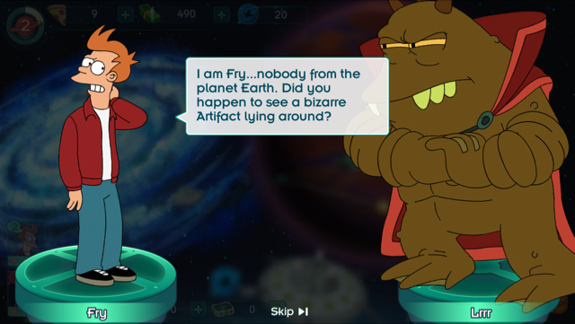

Speaking with Lrrr!

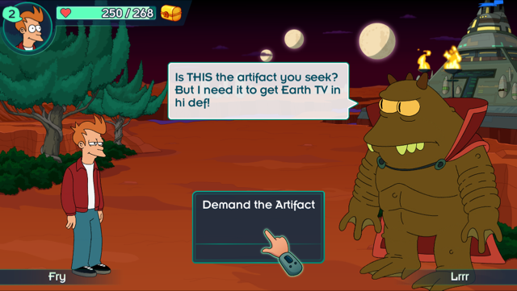

Lrrr still wants to watch a TV.

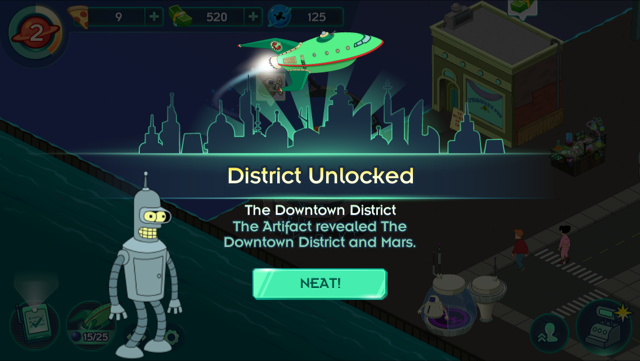

Eventually, the artifact is ours. I think Bender is next member in my team.

I hope the game is good, will check it on the weekend.

Thanks to Jam City who launched this game and big thanks to Matt Groening who launched Futurama!
