In this article, I'm going to share my experience with Oracle ATG logging system and such great tools like Elasticsearch and Kibana. Imagine that we have a big ATG-based project and our task is to store and list all the users who met (explicitly or not) errors. To solve this task we will add a new event listener to filter errors, will face a problem with resolving users' profile from the listener, will send an error report to an Elasticsearch server and finally display the data with Kibana.

Although this article describes creating ATG-specific logging feature, it will be quite easy to adjust this tutorial for using with Slf4j or whatever you want.

Elasticsearch and Kibana are part of so-called ELK stack. Letter "L" stands for Logstash, which is a great tool that crawls data from multiple sources, transforms it and sends to a target (e.g. file or Elasticsearch). However, I decided not to use Logstash here, because Elasticsearch provides a good API which is enough for this task.

So, let's get started.

### Installing Elasticsearch

I recommend reading the [getting started guide](https://www.elastic.co/guide/en/elasticsearch/reference/5.x/getting-started.html) which is really good. The documentation is easy to understand and it gives you the idea of what it is and how it works.

Elasticsearch requires Java 8, so before installation, we need to check the Java version:

```bash
java -version
echo %JAVA_HOME%
```

The installation process is well described in the getting started guide, including different platforms. As I used Windows as a platform, I'll describe the steps to install Elasticsearch in Windows.

- Download ZIP from Elastic website ([here](https://www.elastic.co/downloads/elasticsearch))
- Unzip the archive somewhere you want (D:\\elk\\elasticsearch-5.4.1 in my case)
- Open a command line and navigate to the Elasticsearch dir
- Run elasticsearch.bat from bin directory:

As you can see, it's pretty easy. But it didn't work for me as I had Java 6 installed and my project was using this. So I needed to set the JAVA_HOME variable to JDK 8 directory path for each session, and I created run.bat file for this purpose

```bash
@echo off
set JAVA_HOME=C:\Program Files\Java\jdk1.8.0_131
cd D:\elk\elasticsearch-5.4.1
bin\elasticsearch.bat
```

This did the trick: Elasticsearch started

[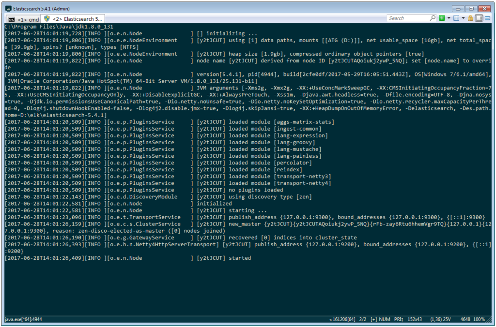](https://imsavva.com/wp-content/uploads/2017/06/elasticsearch_started.png)

### Testing Elasticsearch with CURL

By default, Elasticsearch starts at http://localhost:9200.

In this part of the article, we will send some HTTP queries to Elasticsearch to perform some basic operations. I used [CURL](https://curl.haxx.se/) to do this, but using [Postman](https://www.getpostman.com/) might be better, at least on Windows.

All these commands are described in the original documentation, so we'll just briefly check them:

1. Checking the system's status

Where **?v** parameter means that the output will contain column names. The result should be something like this:

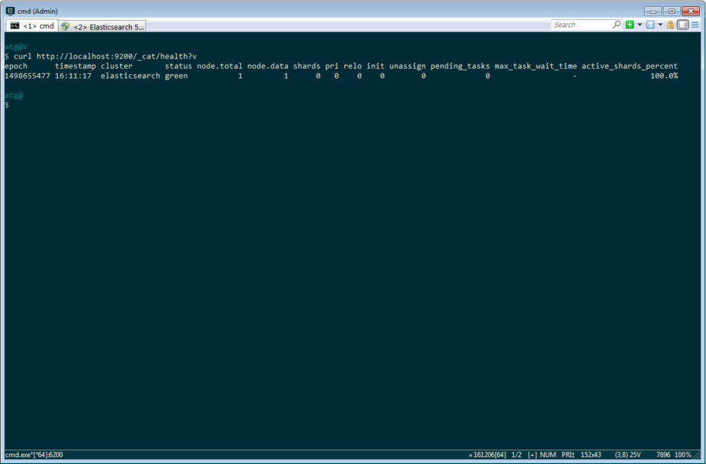

2. Listing all indexes

As we haven't created any indices, there will be shown only column names.

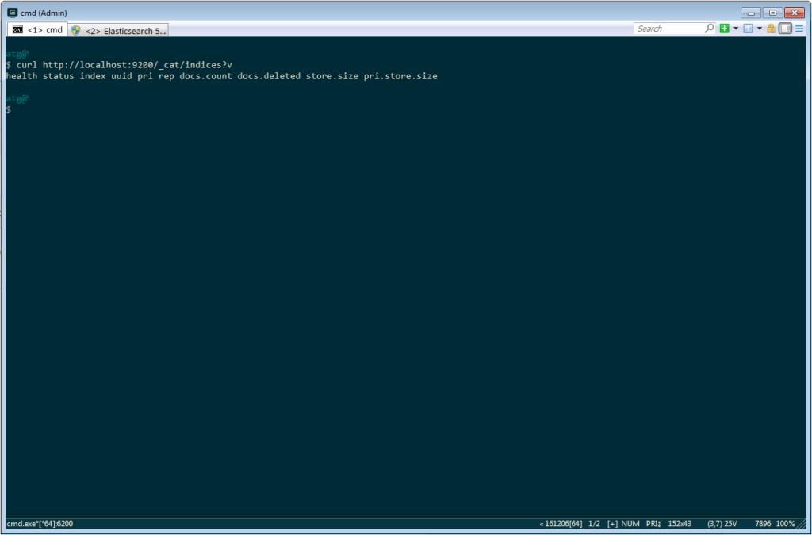

3. Creating an index

```bash
curl -XPUT http://localhost:9200/index-name?pretty
curl http://localhost:9200/_cat/indices?v
```

Here, **?pretty** means that the answer, which is JSON, would be pretty-printed.

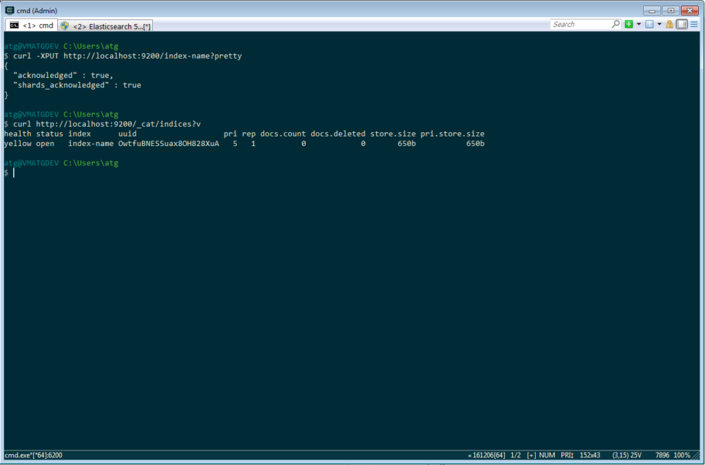

4. Adding some data to the index

```bash
curl -XPUT http://localhost:9200/index-name/type-name/1?pretty -d "{ \"name\": \"Ivan Ivanov\", \"exception_type\": \"Runtime Exception\", \"message\": \"An exception caught... some text\" }"
curl http://localhost:9200/index-name/type-name/1?pretty
```

Here's why the Postman could be better: Windows version of CURL has some problems with apostrophes, so I had to escape the quotes in my query.

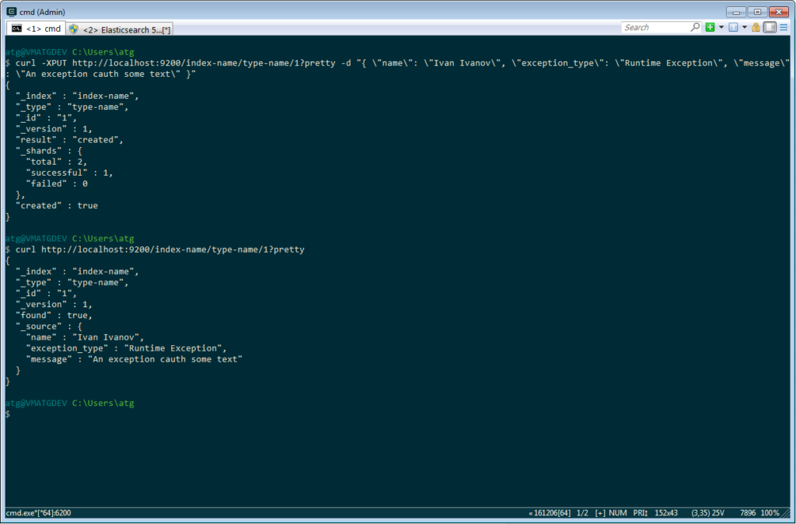

So, we can see that everything works fine and we can move to the next step and visualize our data with Kibana.

### Installing Kibana

Kibana also requires Java 8, so we shouldn't have any problems with it as we've already configured on the first step. The installation process is the same and different ways of installation are described in [Kibana Reference](https://www.elastic.co/guide/en/kibana/current/setup.html).

- Downloading Kibana ([here](https://www.elastic.co/downloads/kibana))
- Unzipping (my path is D:\elk\kibana-5.4.1-windows-x86)
- Opening console and navigating to the Kibana folder
- Running bin/kibana.bat

That's it. Kibana is running:

[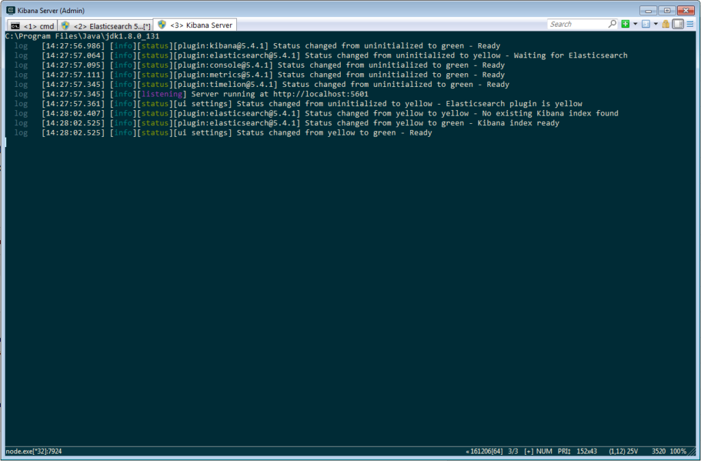](https://imsavva.com/wp-content/uploads/2017/06/runningkibana.png)

### Running and testing Kibana with Elasticsearch

We can access Kibana application at [http://localhost:5601/](http://localhost:5601/). It automatically connects to an Elasticsearch cluster if the default configuration wasn't changed, so we don't need to pair them.

First, we need to configure Kibana to look at our Elasticsearch index. My index name is "index-name", so I specify it in "Index name or pattern" field. I also switched off "Index contains time-based events" checkbox as we don't have such field in our records. After filling the fields, press "Create" button:

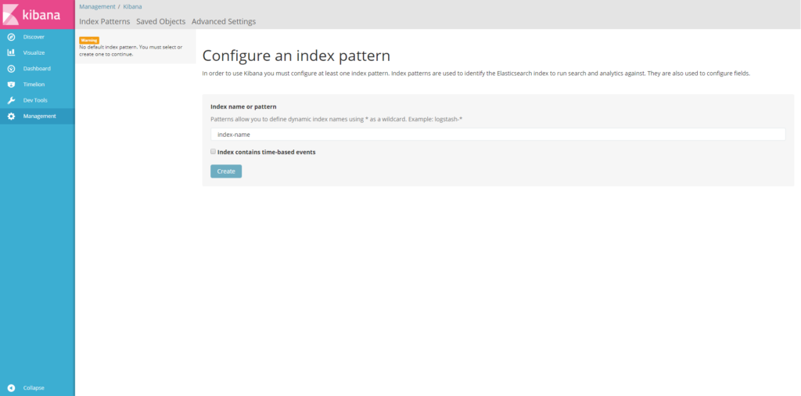

Let's create a simple search result. Go to "Discover" section, select "\_id", "name", "exception_type", "message" fields from the list below "Available fields" label. Click "Save" in the right-top corner and name your first search query.

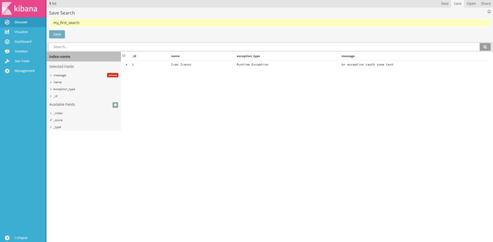

Now let's create a simple dashboard and add our search query there. Open "Dashboard section", press "+ Create a dashboard", click "Add" button, switch to "Saved search" tab and choose the search query you created a minute ago. Click "Save". That's it, our new dashboard is ready.

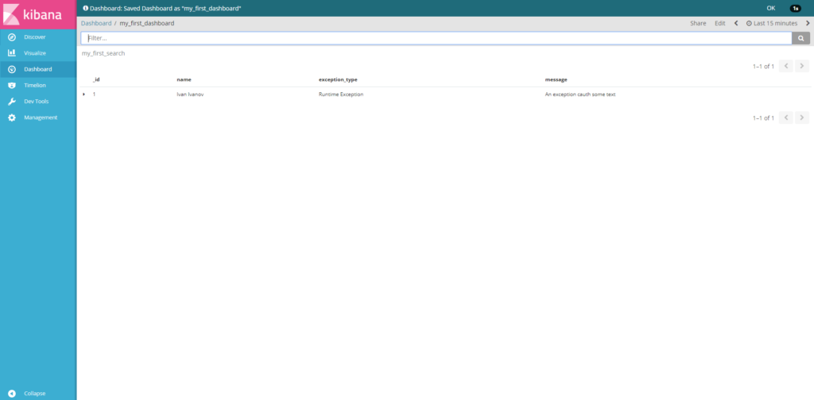

### Solving a profile lookup problem

When I started writing a LogListener implementation, I faced a problem with looking up the current user's profile. That's because we don't have access to the current request object. I decided to describe the solution in a different article, so here is the link to [how to resolve an ATG user profile from a global scoped component that doesn't have access to a request](https://imsavva.com/how-to-lookup-a-user-profile-from-a-global-scoped-atg-component/).

### Writing an ATG log listener

Every time a log event is created, out log listener should check whether the given event is an error or not. In case it is an error, it will resolve users' profile, prepare a message object, convert it to JSON and send it to Elasticsearch via HttpQuerySender which is shown below

```java
// imports are omitted

/**
 * A component that sends HTTP queries.
 *
 * @author Savva Kodeikin
 */
public class HttpQuerySender {

    private static final String CONTENT_TYPE = "Content-Type";
    private static final String UTF_8 = "UTF-8";
    private static final String POST = "POST";

    public void sendPost(String urlAddress, String data, String mediaType) throws IOException {
        HttpURLConnection connection = null;
        OutputStreamWriter writer = null;

        try {
            URL url = new URL(urlAddress);
            connection = (HttpURLConnection) url.openConnection();
            connection.setDoOutput(true);
            connection.setRequestMethod(POST);
            connection.setRequestProperty(CONTENT_TYPE, mediaType);

            writer = new OutputStreamWriter(connection.getOutputStream(), UTF_8);
            writer.write(data);
            writer.flush();

            if (!isResponseCodeOk(connection.getResponseCode())) {
                throw new IOException("Response code is " + connection.getResponseCode());
            }
        } finally {
            if (writer != null) {
                writer.close();
            }

            if (connection != null) {
                connection.disconnect();
            }
        }
    }

    private boolean isResponseCodeOk(int responseCode) {
        return responseCode == HttpURLConnection.HTTP_OK || responseCode == HttpURLConnection.HTTP_CREATED;
    }
}
```

I recommend using try-with-resources construction instead of this old construction above.

```properties
# /com/imsavva/elk/net/HttpQuerySender

$class=com.imsavva.elk.net.HttpQuerySender
```

Describing the component.

```java
public static class ElasticsearchErrorEvent {

    private String userId;
    private String userName;
    private String userEmail;
    private String errorMessage;
    private String environment;
    private String exceptionName;
    private String errorData;
    private String date;

    public ElasticsearchErrorEvent(String userId, String userName, String userEmail, String errorMessage,
                                   String date, String environment) {
        this.userId = userId;
        this.userName = userName;
        this.userEmail = userEmail;
        this.errorMessage = errorMessage;
        this.date = date;
        this.environment = environment;
    }

    // setters, getters and toString methods are omitted
}
```

A Java bean to store a message before converting to JSON.

```java
/**
 * LogListener that handles ErrorLogEvents and pushes them to Elasticsearch via HTTP.
 *
 * @author Savva Kodeikin
 */
public class ElasticsearchLogSenderLogListener extends GenericService implements LogListener {

    private static final String PROFILE_COMPONENT = "/atg/userprofiling/Profile";
    private static final String COLON_AND_SLASHES = "://";
    private static final String FIRST_NAME = "firstName";
    private static final String LAST_NAME = "lastName";
    private static final String EMAIL = "email";
    private static final int WWW_OFFSET = 4;

    private DateFormat format = new SimpleDateFormat("yyyy-MM-dd'T'HH:mm:ssZ");
    private HttpQuerySender httpQuerySender;
    private String elasticsearchUrl;
    private RequestContainer requestContainer;
    private List<String> environments;

    @Override
    public void logEvent(LogEvent logEvent) {
        if (logEvent instanceof ErrorLogEvent) {
            Profile profile = getProfile();

            if (profile != null && !profile.isTransient()) {
                String environment = resolveCurrentEnvironment();

                if (environment != null) {
                    ElasticsearchErrorEvent event = createErrorEvent(logEvent, profile, environment);
                    try {
                        httpQuerySender.sendPost(getElasticsearchUrl(), JsonUtils.toJson(event),
                                MediaType.APPLICATION_JSON);
                    } catch (IOException e) {
                        logWarning("Unable to send an error event to the Elasticsearch server, event = "
                                + event.toString(), e);
                    }
                }
            }
        }
    }

    public ElasticsearchErrorEvent createErrorEvent(LogEvent logEvent, Profile profile, String environment) {
        String userName = profile.getPropertyValue(FIRST_NAME) + " " + profile.getPropertyValue(LAST_NAME);
        String email = (String) profile.getPropertyValue(EMAIL);

        ElasticsearchErrorEvent event = new ElasticsearchErrorEvent(profile.getRepositoryId(), userName, email,
                logEvent.getMessage(), format.format(logEvent.getDateTimeStamp()), environment);

        if (logEvent.getThrowable() != null) {
            event.setErrorData(logEvent.getThrowable().toString());
            event.setExceptionName(logEvent.getThrowable().getClass().getName());
        }

        return event;
    }

    private String resolveCurrentEnvironment() {
        DynamoHttpServletRequest request = requestContainer.getRequest();
        String requestUrl = removeUrlScheme(request.getRequestURL().toString());

        for (String environment : getEnvironments()) {
            if (requestUrl.startsWith(environment) || requestUrl.startsWith(environment, WWW_OFFSET)) {
                return environment;
            }
        }

        return null;
    }

    private String removeUrlScheme(String url) {
        if (url.contains(COLON_AND_SLASHES)) {
            url = url.substring(url.indexOf(COLON_AND_SLASHES) + COLON_AND_SLASHES.length());
        }

        return url;
    }

    // getters and setters are omitted
}
```

Here's the LogListener implementation that uses HttpQuerySender to send the error messages to Elasticsearch.

Warning! This way of using DateFormat could be dangerous because this class is not thread-safe. You may create a new instance each time the logEvent() method is invoked. As an alternative, consider using one instance per thread as described in [this article](https://imsavva.com/using-one-dateformat-instance-per-thread-with-threadlocal).

```properties
# /atg/dynamo/service/logging/ElasticsearchLogSenderLogListener

$class=com.imsavva.elk.logging.ElasticsearchLogSenderLogListener requestContainer=/com/imsavva/elk/request/RequestContainer httpQuerySender=/com/imsavva/elk/net/HttpQuerySender elasticsearchUrl=http://localhost:9200/error-tracking/report environments=\
production.ru,\
localhost:7003,\
```

Configuration for the LogListener implementation.

```properties
# Global.properties

logListeners+=\
/atg/dynamo/service/logging/ElasticsearchLogSenderLogListener
```

Add a Global.properties file (at the level you need) in which specify that we're adding our log listener from this point.

After compiling and running the application, our log listener should be running. We can check it in the component browser at http://localhost:7003/dyn/admin:

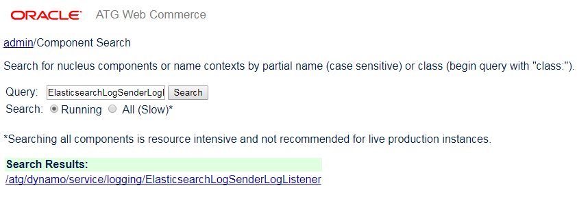

### Running them altogether

As our log listener catches some errors, we will see it in Kibana. Here's an example:

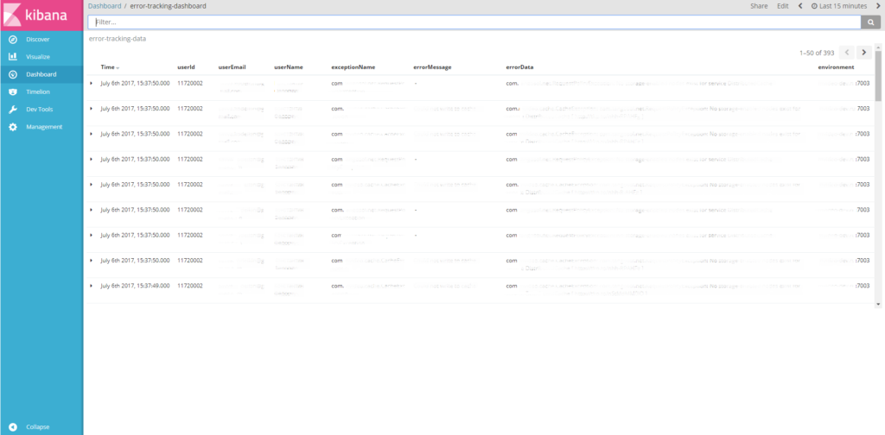

That's it. I hope this could be helpful for you. Thanks for reading. 🙏😊
