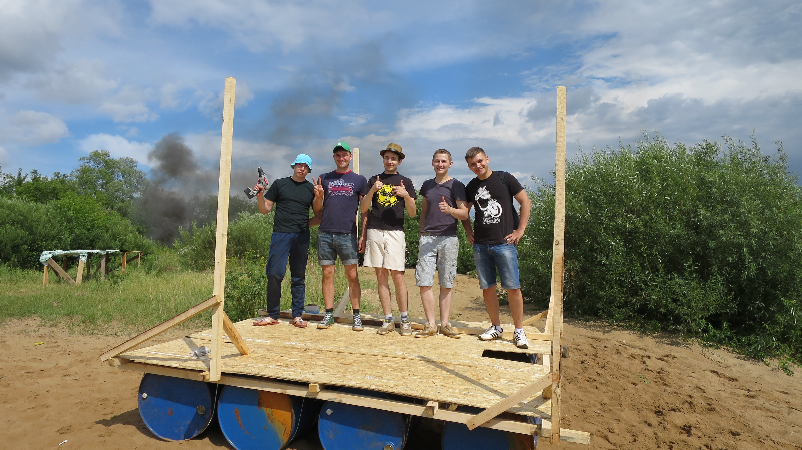
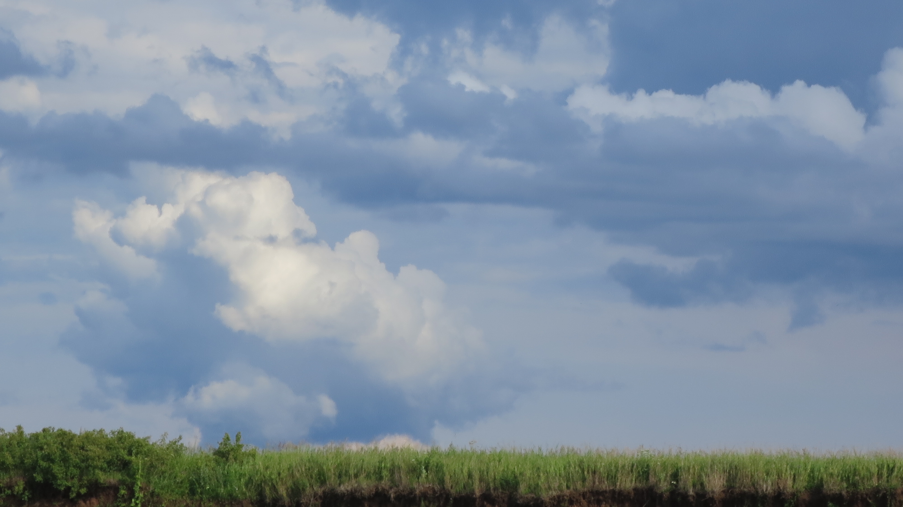
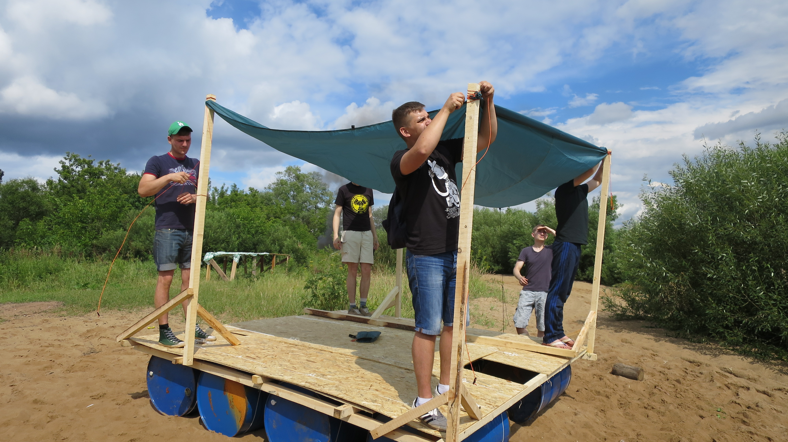

Last weekend we rafted by our small river. We made a raft for 6 hours, sailed on it for about 11 hours and covered about 15 kilometers.

It was a great adventure. The weather was not so friendly, there were a thunderstorm. After about four hours of rafting we were in Ivan'kovskaya backwater, and suddenly three of us fell overboard. No one can remember how they did that, it was like the sirens started signing around us.

This year the cheapest "AUCHAN's" BBQ didn't fall apart, as it did one year ago, moreover it helped us a lot. Those who didn't fall overboard, became wet because of the rain, but we put BBQ in the center of the raft, gather some dry wood and started a fire. The weather become warmer.

I thought about why are we doing it? I do it because after this journey you can better understand how it's beautiful to stand on the ground. Because our raft it's our small state with our rules. Because it's just funny.

(This toxic fire is not ours)

Is it going to be rainy?

