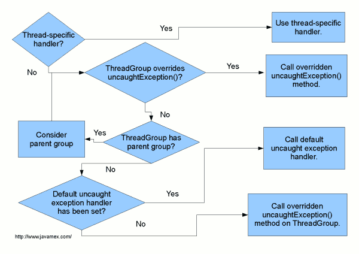

In this short tutorial, I'm going to describe how to handle uncaught exceptions in threads. This can be done by:

- Using threadInstance.setUncaughtExceptionHandler() ─ for a specific thread
- Overriding ThreadGroup's uncaughtException() method ─ for a thread group
- Using Thread.setDefaultUncaughtExceptionHandler() ─ for all threads

If you're interested in how to implement this, press "read more", I've prepared an example.

The scheme below shows how Java treats uncaught exceptions.



If a thread has its handler set, this handler is used. If not, the thread's ThreadGroup uncaughtException is invoked. This method does the rest of the actions in the scheme:

```java
public void uncaughtException(Thread t, Throwable e) {
    if (parent != null) {
        parent.uncaughtException(t, e);
    } else {
        Thread.UncaughtExceptionHandler ueh =
            Thread.getDefaultUncaughtExceptionHandler();
        if (ueh != null) {
            ueh.uncaughtException(t, e);
        } else if (!(e instanceof ThreadDeath)) {
            System.err.print("Exception in thread \""
                             + t.getName() + "\" ");
            e.printStackTrace(System.err);
        }
    }
}
```

Now we can try it by ourselves. Here is an example that shows all three types of exception handling:

```java
package com.imsavva.uncaughtexceptions;

/**
 * @author Savva Kodeikin
 */
public class CustomThreadGroup extends ThreadGroup {

    public CustomThreadGroup(String name) {
        super(name);
    }

    public CustomThreadGroup(ThreadGroup parent, String name) {
        super(parent, name);
    }

    @Override
    public void uncaughtException(Thread thread, Throwable exception) {
        System.out.printf("Uncaught exception in the ThreadGroup: thread=%s, throwable=%s\n", thread, exception);
    }
}
```

Custom ThreadGroup class overrides uncaughtException() method.

```java
package com.imsavva.uncaughtexceptions;

/**
 * @author Savva Kodeikin
 */
public class CustomUncaughtExceptionHandler implements Thread.UncaughtExceptionHandler {

    private String name;

    public CustomUncaughtExceptionHandler(String name) {
        this.name = name;
    }

    @Override
    public void uncaughtException(Thread thread, Throwable exception) {
        System.out.printf("Uncaught exception intercepted by %s exception handler: thread=%s, throwable=%s\n",
                name, thread, exception);
    }

    public String getName() {
        return name;
    }

    public void setName(String name) {
        this.name = name;
    }
}
```

Custom uncaught exception handler also overrides uncaughtException() method. The name field is used to differ handler instances.

```java
package com.imsavva.uncaughtexceptions;

/**
 * @author Savva Kodeikin
 */
public class UncaughtExceptionHandlingTutorial {

    public static void main(String[] args) {
        ThreadGroup customThreadGroup = new CustomThreadGroup("CustomThreadGroup");

        Thread thread1 = new Thread(customThreadGroup, new MyRunnable());
        Thread thread2 = new Thread(customThreadGroup, new MyRunnable());
        Thread thread3 = new Thread(new MyRunnable());

        thread1.start();
        thread2.start();
        thread3.start();

        Thread.setDefaultUncaughtExceptionHandler(new CustomUncaughtExceptionHandler("Default"));
        thread1.setUncaughtExceptionHandler(new CustomUncaughtExceptionHandler("Thread's"));
    }

    static class MyRunnable implements Runnable {

        @Override
        public void run() {
            try {
                Thread.sleep(5000);
            } catch (InterruptedException e) {
                e.printStackTrace();
            }

            throw new NullPointerException("Why not?");
        }
    }
}
```

Main class starts three threads, two of them are grouped in our CustomTrheadGroup. One of them has its own exception handler. After thread sleep, they throw NullPointer exceptions. Here is the console result:

```
Uncaught exception in the ThreadGroup: thread=Thread[Thread-1,5,CustomThreadGroup], throwable=java.lang.NullPointerException: Why not?
Uncaught exception intercepted by Thread's exception handler: thread=Thread[Thread-0,5,CustomThreadGroup], throwable=java.lang.NullPointerException: Why not?
Uncaught exception intercepted by Default exception handler: thread=Thread[Thread-2,5,main], throwable=java.lang.NullPointerException: Why not?

Process finished with exit code 0
```

As we can see from the result, all the exceptions were caught.
