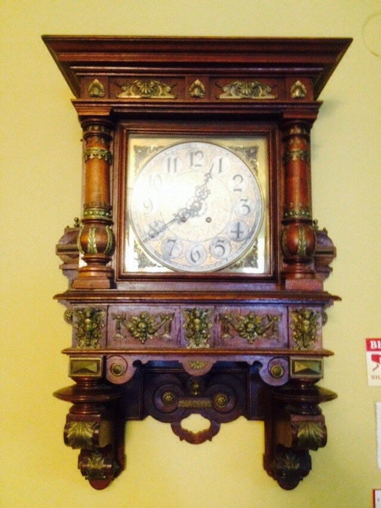
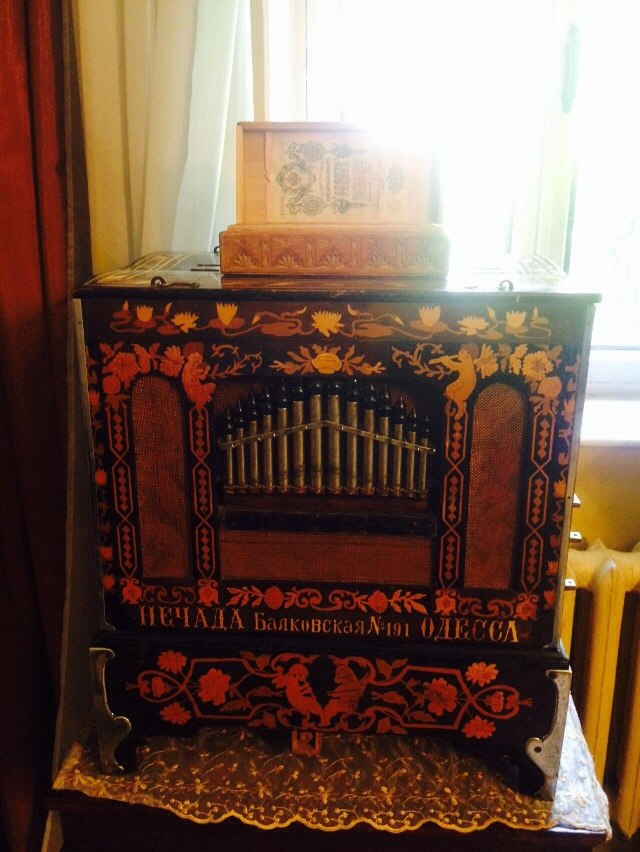
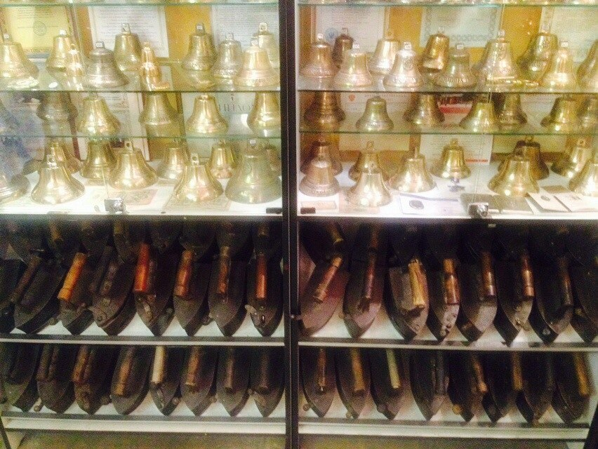
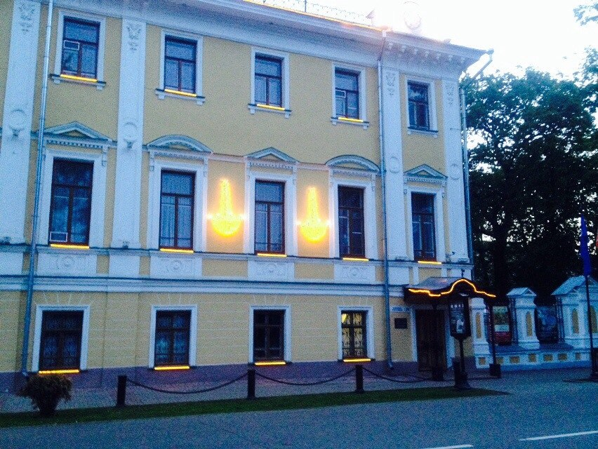
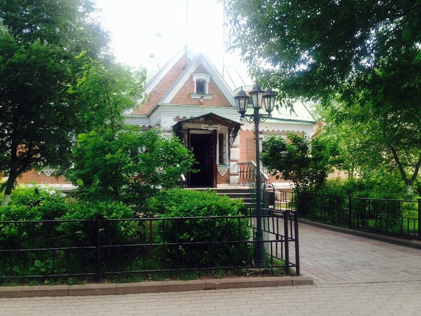
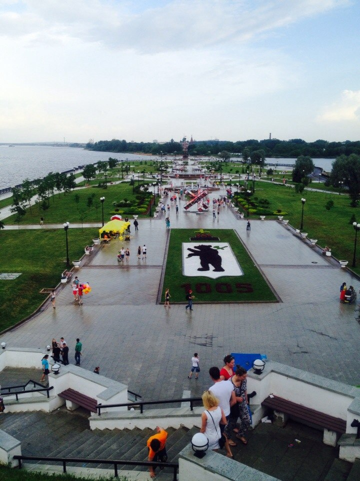
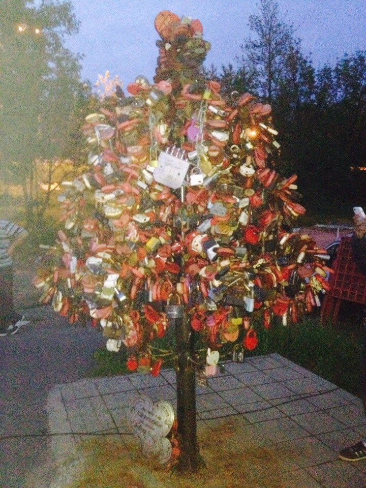

In May we've been to Yaroslavl. This beautiful old city located about 270 km from Moscow, and it's my grandmother's hometown.

Theity center is very interesting, there are lots of old churches, buildings and monuments.

There was the City Day, when we came there. There were hundreds cotton candy sellers, and the embankment  was ovecrowded.

We also visited John Mostoslavsky's museum, called "Music and Time". John is an artist, and all his life he collected old watches, bells, gramophones and smoothin-irons.

Here are some photos.

