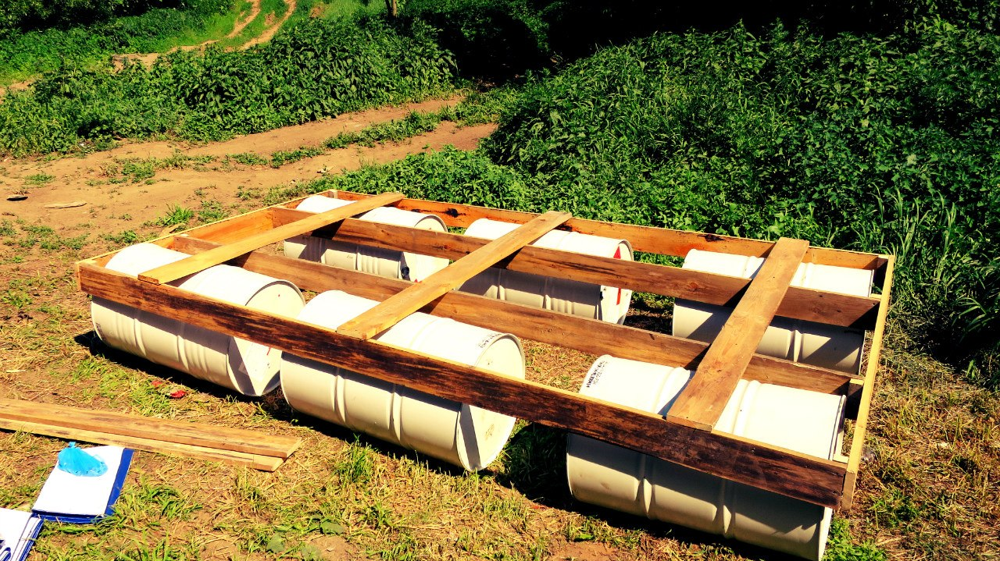

Last year (as I remember it was 05 June 2014) we fused with friends on a raft, which was created by us. We used six 200 liters barrels and some boards, one friend of mine made a paddle-wheel, that worked really bad, the chain always jumped out the sprocket. But it looked cool, it was an interesting mechanism. They fused two days, but I left them on the second day, because 6 June is my friend's b-day, so I had to go in another town to congratulate him. The path length was about 50 km, and we went 25 km for 12 hours! It was really nice and funny. This year we will repeat our journey, I hope it will be at least like in last year, or better.

Some photos from 2014:

